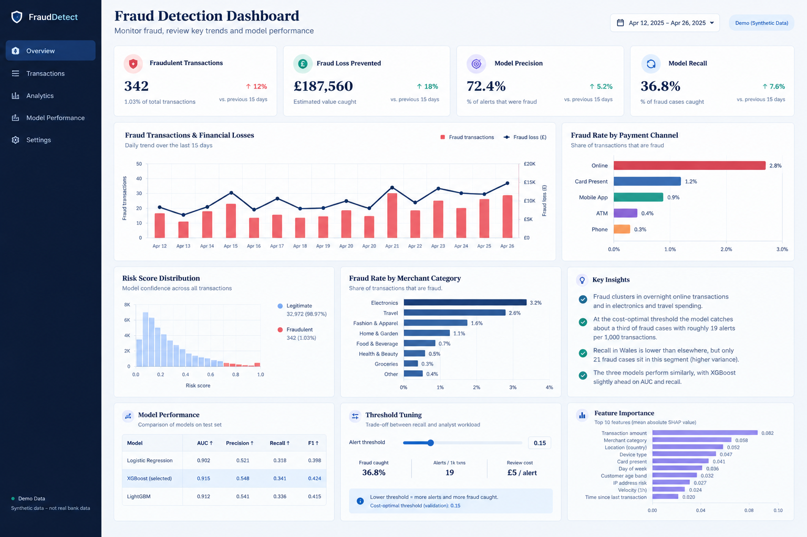

# Card Fraud Detection: From Model to Business Decision

<p align="center">
  
</p>

<p align="center">
  <strong>End-to-end machine learning project for fraud detection, explainability, fairness monitoring, and cost-based decision-making.</strong>
</p>

<p align="center">
  
  
  
  
  
  
</p>

## Overview

This project demonstrates an end-to-end card fraud detection pipeline, from synthetic transaction data and time-aware model validation to explainability, fairness monitoring, and business-oriented decision thresholds.

The objective is not simply to classify transactions as fraudulent or legitimate. It is to investigate how model predictions can support operational decisions while accounting for fraud losses, manual review costs, model performance, and potential differences across customer segments.

**Pipeline:**

`Data Generation → Feature Engineering → Time-Based Validation → Model Comparison → Threshold Optimisation → SHAP Explainability → Fairness Monitoring → Scoring API → Tableau Dashboard`

> **Data note:** All transactions are synthetic, generated using the seeded generator in `src/generate_data.py`. Results demonstrate the methodology and are not evidence of real-world fraud detection performance.

## Key Results

Evaluation uses the held-out final 15 days, containing 33,314 transactions and 273 fraud cases.

| Metric | Result |
|---|---:|
| Held-out transactions | 33,314 |
| Fraud cases | 273 |
| Selected model | XGBoost |
| XGBoost ROC-AUC | 0.823 |
| XGBoost PR-AUC | 0.159 |
| Recall at selected threshold | 36.6% |
| Precision at selected threshold | 16.2% |
| Alerts per 1,000 transactions | 18.6 |
| Fraud value caught | Approximately £6.9k |
| Total fraud value | Approximately £17.2k |
| Estimated net saving | Approximately £3.8k |

The decision threshold of **0.83** was selected using validation data and frozen before evaluation on the test set. The estimated net saving accounts for the assumed £5 manual review cost per alert.

These are results from the synthetic dataset and should not be interpreted as expected production performance.

## Model Comparison

| Model | Test ROC-AUC | Test PR-AUC |
|---|---:|---:|
| Logistic Regression | 0.845 | 0.155 |
| Random Forest | 0.818 | 0.162 |
| XGBoost | 0.823 | 0.159 |

XGBoost was selected based on validation PR-AUC, with only a small difference between the models.

Logistic Regression achieved the highest test ROC-AUC, while Random Forest achieved the highest test PR-AUC in the reported test results. This illustrates why model selection should be based on a clearly defined validation strategy rather than a single metric observed on the test set.

For a regulated environment, a simpler and more interpretable model could be preferable if its operational performance is sufficiently competitive.

## Project Design

### 1. Time-Aware Validation

The data is split chronologically to reduce look-ahead leakage:

- **Training:** Days 1–60
- **Validation:** Days 61–75
- **Testing:** Days 76–90

The final test period is held out from model and threshold selection.

### 2. Evaluation for Imbalanced Classification

Fraud represents a small proportion of transactions. Consequently, accuracy alone can be misleading.

The project evaluates models using:

- **PR-AUC:** Performance on the minority fraud class.
- **ROC-AUC:** Ability to rank fraudulent transactions above legitimate ones.
- **Precision:** Proportion of flagged transactions that are fraudulent.
- **Recall:** Proportion of fraud cases detected.
- **Business value:** Estimated fraud value caught after accounting for review costs.

### 3. Cost-Based Decision Threshold

A default probability threshold of 0.5 does not necessarily reflect the needs of a fraud operations team.

The threshold is selected using validation data to balance estimated fraud value caught against the cost of reviewing flagged transactions.

At the selected threshold:

- Recall is 36.6%.
- Precision is 16.2%.
- Approximately 18.6 alerts are generated per 1,000 transactions.
- Approximately £6.9k of £17.2k in fraud value is caught.
- Estimated net savings are approximately £3.8k.

The review cost is an assumption of £5 per alert and can be adjusted in `train.py`.

### 4. Explainability with SHAP

SHAP is used to examine the features contributing to model predictions.

The project includes:

- Global feature importance.
- Per-transaction explanations.
- The top three reasons returned by the scoring API.

These explanations can help analysts investigate why a transaction received a high fraud score. They should be treated as model explanations, not proof that a transaction is fraudulent.

### 5. Fairness Monitoring

The project excludes `age_band` and `region` from model inputs and monitors recall and false-positive rates across segments.

Segment-level metrics are intended to identify potential differences that require further investigation.

For example, Wales has 21 fraud cases and lower observed recall in the synthetic test results. Because the number of cases is small, this estimate may be noisy and is not sufficient to establish systematic bias.

Fairness monitoring should include sample sizes, uncertainty, customer impact, and follow-up analysis before conclusions are drawn.

### 6. Scoring API

The project exposes a fraud scoring API using FastAPI.

For each transaction, the API returns:

- Fraud risk score.
- Classification or decision.
- Top three explanatory reasons.

Run the API locally and explore its endpoints using the automatically generated Swagger documentation.

### 7. Tableau Dashboard

The dashboard is intended to communicate model performance and fraud operations through visual summaries of:

- Fraud transactions and financial losses over time.
- Risk score distribution.
- Fraud rates by payment channel.
- Fraud rates by merchant category.
- Model performance comparisons.
- Decision threshold and review workload.
- Feature importance.
- Segment-level fairness metrics.

The screenshot above is a **dashboard concept/mockup** for portfolio presentation. It is not a live Tableau dashboard, and its illustrative values should not be mistaken for measured results from the project. Use the actual exported project metrics when building or publishing the final Tableau workbook.

## Technology Stack

| Technology | Purpose |
|---|---|
| Python | Data processing and modelling |
| Pandas / NumPy | Data manipulation |
| Scikit-learn | Model training and evaluation |
| XGBoost | Gradient-boosted fraud classification |
| SHAP | Model explainability |
| FastAPI | Fraud scoring API |
| Tableau | Dashboard and operational reporting |
| Pytest | Automated tests |

Only list packages and tools that are actually used in the repository.

## Getting Started

### Prerequisites

- Python 3.10 or later.
- Git.
- A local copy of this repository.

### 1. Clone the repository

```bash
git clone <YOUR_GITHUB_REPOSITORY_URL>
cd card-fraud-detection
```

Replace `<YOUR_GITHUB_REPOSITORY_URL>` with your actual GitHub repository URL.

### 2. Create a virtual environment

```bash
python -m venv .venv
```

Activate it on macOS or Linux:

```bash
source .venv/bin/activate
```

Activate it on Windows PowerShell:

```powershell
.venv\Scripts\Activate.ps1
```

### 3. Install dependencies

```bash
pip install -r requirements.txt
```

### 4. Generate the synthetic dataset

```bash
python src/generate_data.py
```

This creates `data/transactions.csv`.

### 5. Train and evaluate the models

```bash
cd src
python train.py
cd ..
```

The training pipeline writes its generated outputs to the configured `outputs/` and `tableau/` directories.

### 6. Run the tests

```bash
pytest -q tests
```

The repository is expected to include five tests. Run the command to verify the current test results in your environment.

### 7. Start the scoring API

```bash
uvicorn api:app --app-dir src --reload
```

Open the interactive API documentation at:

http://127.0.0.1:8000/docs

## Repository Structure

```text
card-fraud-detection/
├── images/
│   └── fraud-dashboard.png
├── src/
│   ├── generate_data.py
│   ├── train.py
│   └── api.py
├── tests/
├── tableau/
│   └── segment_performance.csv
├── outputs/
├── requirements.txt
└── README.md
```

This is an illustrative structure. Adjust filenames and folders to match the actual repository.

## Limitations and Next Steps

The project has several important limitations:

- **Synthetic data:** Fraud patterns are hand-built and may not represent real transaction behaviour.
- **Concept drift:** The current pipeline does not model changing fraud strategies over time.
- **Adversarial adaptation:** Fraudsters may change behaviour in response to detection systems.
- **Review-cost assumptions:** A flat £5 cost per alert simplifies real operational costs.
- **Customer impact:** The current cost calculation does not fully account for genuine transactions being declined or delayed.
- **Fairness uncertainty:** Small segment sample sizes make some performance estimates unstable.
- **Production governance:** Real deployment would require privacy review, monitoring, security controls, and model-risk governance.

Potential next steps include temporal drift monitoring, confidence intervals for segment metrics, customer-impact analysis, calibration checks, and testing on appropriately governed real-world data.

## Conclusion

This project demonstrates how fraud detection can be approached as a **business decision problem**, rather than solely a classification task.

It combines time-aware evaluation, imbalanced classification metrics, cost-based threshold selection, explainability, fairness monitoring, and API delivery into a reproducible pipeline.

The key lesson is that a useful fraud detection model must be evaluated not only by how well it ranks transactions, but also by the review workload, financial assumptions, and risks associated with its decisions.

---

**Disclaimer:** This project uses synthetic data for educational and portfolio purposes. The results do not represent real bank performance and are not a recommendation to deploy the model in production.
